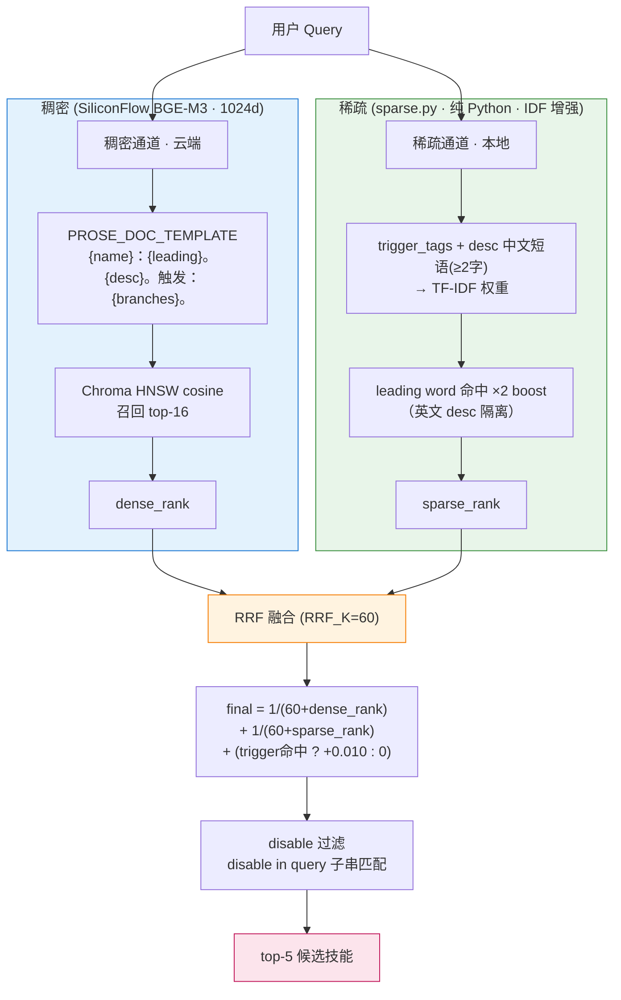

# Hermes Micro Framework

> Hermes 微内核框架配置模板仓库。极致拆解 SOUL.md + 按分类组织的技能集 + vdb 语义检索。

本仓库提供一套**微内核架构**的 Hermes 配置方案：SOUL.md 仅保留不可撼动的铁律和路由表，所有方法论、工作流、约束细则全部分布在独立 skill 中，通过 vdb 按需加载。

**核心分界（成熟 Agent 框架标准做法）**：
- **代码 + 元数据入库**：`vdb/*.py`、`scripts/*`、`skills/**`（62 个技能的全部 frontmatter 是框架元数据资产）
- **索引 + 运行时状态本地生成**：Chroma 向量索引、`.venv`、`.env` 由 `install.sh` 在用户机器上就地重建，不入库

---

## v1.0 状态

- **算法层已收敛**：RRF 融合（K=60）+ IDF 增强 sparse + trigger 加法加成（×0.010）+ desc 中文短语入索引，全部完成
- **benchmark 稳定**：正式集 61 条 T1=88.3%/T3=91.7%；harder 集 17 条 T1=70.6%/T3=94.1%
- **元数据层达标**：62 个技能全部 trigger ≥ 7、disable ≥ 2
- **能力边界确认**：剩余失败 case 100% 为 BGE-M3 dense 语义偏差，非元数据可解（换 embedding 模型或 dense 侧 fine-tune 才能突破）

---

## 目录结构

```
hermes-micro-framework/
├── install.sh                 # 一键部署（新装全量 / 存量补充 / --profile）
├── README.md                  # 本文件
├── LICENSE                    # MIT
├── TROUBLESHOOTING.md         # 故障排查指南
│
├── SOUL.md                    # → ~/.hermes/SOUL.md（存量不覆盖）
├── .env.example               # → ~/.hermes/.env（仅当不存在时）
│
├── memories/
│   ├── USER.md                # 用户画像模板
│   └── FRAMEWORK_EVOLUTION.md # 框架演进记录
│
├── vdb/                       # 技能检索工具链（纯代码，不含索引）
│   ├── sparse.py              # 词法权重（纯 Python, IDF 增强）
│   ├── embed.py               # SiliconFlow BGE-M3 云端嵌入
│   ├── indexer.py             # Chroma 索引构建（PROSE 模板 + IDF）
│   ├── matcher.py             # RRF 混合检索（K=60 + trigger 加成）
│   ├── eval_skill.py          # 盲测工具
│   └── __init__.py
│
├── scripts/
│   ├── init-vdb.sh            # .venv + pip + build_index
│   └── vdb-autoload.py        # 预热 + 索引过期检测 + 自动重建
│
└── skills/                    # 元数据资产（62 技能，全量同步）
    ├── core/ workflow/ methodology/ infrastructure/ integration/  # 框架核心技能
    ├── media/ research/ mlops/ smart-home/ social-media/ email/   # 外部吸收的领域技能
    ├── apple/ data-science/ ...                                    # 平台/工具技能
    └── templates/NEW_SKILL_TEMPLATE.md
```

**不入库**：`~/.hermes/memories/MEMORY.md`（隐私）、`~/.hermes/.env`（密钥）、`~/.hermes/vdb/chroma/`（索引）、`~/.hermes/vdb/.venv/`（运行时）。

---

## 系统要求

### 必须
- **Hermes Agent**（任意版本，推荐最新）
  - 安装：`curl -fsSL https://hermes-agent.nousresearch.com/install.sh | bash`
  - 或：`pip install hermes-agent`
- **Git**（clone 仓库）
- **Python 3.10+**（vdb 工具链）
- **网络**（vdb 需要访问 SiliconFlow API 做嵌入）

### 可选
- `gh` CLI（推荐，用于推送/查看仓库）
- SiliconFlow API Key（免费 2000 RPM，[注册](https://siliconflow.cn)）

---

## 安装

### 全新安装（无 `~/.hermes/`）

```bash
git clone https://github.com/dandanlan8090/hermes-micro-framework.git
cd hermes-micro-framework
bash install.sh
```

脚本自动完成：
1. 复制 `SOUL.md`、`memories/USER.md` 到 `~/.hermes/`
2. 从 `.env.example` 创建 `~/.hermes/.env`
3. 补充 skills/ 到 `~/.hermes/skills/`
4. 复制 vdb/ 工具链
5. 创建 Python 虚拟环境 + 安装依赖
6. **重建 Chroma 向量索引**（`build_index(force=True)`）
7. **vdb 预热 + 索引过期检测**（自动重建）

完成后：
```bash
# 编辑 API Key
nano ~/.hermes/.env

# 启动 Hermes
hermes chat
```

### 存量更新（已有 `~/.hermes/`）

```bash
git clone https://github.com/dandanlan8090/hermes-micro-framework.git
cd hermes-micro-framework
bash install.sh
```

存量模式特点：
- **跳过** SOUL.md / USER.md（提示手动 `diff` 合并）
- **补充** skills/ 中不存在的技能
- **覆盖** vdb/ 工具链（安全）
- 跳过 .venv 重建

手动合并核心文件：
```bash
diff -u ~/.hermes/SOUL.md  SOUL.md
diff -u ~/.hermes/memories/USER.md memories/USER.md
```

### 多 Profile 安装

```bash
hermes profile list   # ◆ 标记活跃 profile
bash install.sh --profile work
```

Profile 模式下：
- `SOUL.md` → `~/.hermes/profiles/<name>/`
- `skills/` → `~/.hermes/profiles/<name>/skills/`
- `vdb/` → 全局共享
- `.env` → 全局共享

### 强制覆盖

```bash
bash install.sh --force
```

全量覆盖包括 SOUL.md / USER.md。仅新装机使用。

---

## 配置

### 1. API Key（必须）

vdb 使用硅基流动的 BGE-M3 做云端嵌入。编辑 `~/.hermes/.env`：

```bash
SILICONFLOW_API_KEY=sk-your-key
```

免费注册：https://siliconflow.cn

### 2. 切换嵌入模型（可选）

修改 `vdb/embed.py` 顶部两个常量：

```python
API_URL = "https://api.siliconflow.cn/v1/embeddings"  # 换 URL
MODEL = "BAAI/bge-m3"                                   # 换模型名
```

改完重建索引：`cd ~/.hermes/vdb && source .venv/bin/activate && PYTHONPATH=$PWD python3 -c "from indexer import build_index; build_index(force=True)"`

### 3. 框架演进钩子

框架变更自动记录到 `~/.hermes/memories/FRAMEWORK_EVOLUTION.md`，每积累 3 条触发一次评审。

---

## 使用

### 启动 Hermes

```bash
hermes chat                    # 默认 profile
hermes -p work chat            # 指定 profile
```

### SOUL.md 铁律

启动后 SOUL.md 的 7 条铁律自动加载：

| # | 铁律 | 完整细则 |
|---|------|----------|
| 0 | 技能检索（强制入口）：命中路由表/任务对应skill/不确定/涉铁律操作时必须检索 | 四层检索 vdb > 路由表 > 列表 > 手动 |
| 1 | 信息真实性：不得编造 | `hermes-truth-redline` |
| 2 | 代码输出：完整代码块 | `hermes-code-output` |
| 3 | 验证前置：IDENTIFY→RUN→READ→VERIFY | `hermes-verification-rules` |
| 4 | 安全约束：不生成恶意脚本 | `hermes-safety` |
| 5 | 改进优先：patch > 新建 | `hermes-evolution-rules` |
| 6 | 思考范围：不规划后续/不预判/不过度推演/不拓展 | 4 个 boundary 微技能 |

铁律#6 拆为 4 个微技能，按违规行为精准触发：
- 规划后续对话 → `hermes-boundary-no-future-planning`
- 预判后续任务 → `hermes-boundary-no-task-prediction`
- 过度推演 → `hermes-boundary-no-over-reasoning`
- 自行拓展场景 → `hermes-boundary-no-scope-creep`

### vdb 按需加载

框架技能通过 vdb 语义检索按需加载：

```bash
# 健康检查
python3 ~/.hermes/scripts/vdb-autoload.py --check

# 手动测试召回
cd ~/.hermes/vdb && source .venv/bin/activate
PYTHONPATH=$PWD python3 -c "from matcher import search; [print(r['skill_name'], r['final_score']) for r in search('你的问题')[:5]]"
```

### 主脑模式

当需要多 Agent 调度时，说"使用主脑模式"或"Oracle Mode"，系统自动加载 `hermes-oracle-mode` skill。

### 典型对话示例（按需加载实测）

**场景**：用户说"部署 flask 到生产环境"。系统不做全量加载，而是用 vdb 语义检索从 62 个技能里找出最相关的。

实际检索链路（真实输出）：

```
Query: "部署 flask 到生产环境"

┌─ 稠密通道 (BGE-M3 1024d)
│   "部署 flask 到生产环境" → 向量 → Chroma cosine top-16
│   hermes-shipping-verification 排 dense_rank=2
│
├─ 稀疏通道 (trigger: 部署/生产/发布/服务部署 ...)
│   hermes-shipping-verification 的 trigger 命中 → sparse_rank=1
│
└─ RRF 融合 (K=60): 1/(60+2) + 1/(60+1) ≈ 0.0331
    + trigger 命中 +0.010 → 综合得分 0.0425（实测第一）

Top-5 召回：
  1. ◀ hermes-shipping-verification   final=0.0425  (dr=2, sr=1)
  2.   system-admin                   final=0.0408  (dr=8, sr=2)
  3.   mlops-inference                final=0.0317
  4.   hermes-tdd-workflow            final=0.0313
  5.   repo-publishing-workflow       final=0.0305
```

**结果**：系统只加载 `hermes-shipping-verification` 这一个技能（而非全部 62 个），从中读出"发布前质量门控 + 回滚计划"的工作流，按需执行。

**对比全量模式**：若把所有技能塞进 system prompt，token 开销约 50K+；按需加载只注入 1 个技能（约 400-800 token），**省 95%+**。

> 注：不是所有 query 都命中完美。例如"帮我部署这个服务"因 BGE-M3 语义偏差会更靠近 `system-admin`（见 §技能检索系统 → 能力边界）。这是 embedding 模型上限，非元数据问题。

### 配置领域无关性（重要）

本框架的适配度遵循一个核心原则：**铁律不挑领域，skill 决定适配。**

- **SOUL.md 七条铁律 = 跨所有生产类型的"宪法"**：保证无论干哪类任务都守规矩（信息真实 / 验证前置 / 安全约束 / 代码完整输出 / 改进优先于新增…），但它**不决定当前配置适合什么生产类型**。
- **真正决定适配度的是 `skills/` 资产库的主题分布**：vdb 按需注入，不命中的 skill 永不进对话。所以"这套配置适合什么生产类型" = 你手里有什么 skill。

实测资产分布（v1.0，62 个活跃 skill，不含 `.archive`）：

| 主题域 | skill 数 | 代表 |
|--------|---------|------|
| AI Agent 架构 / 框架维护 | 13 | `hermes-oracle-mode` `hermes-parallel-dispatch` `agent-collaboration-workflow` `hermes-agent-skill-authoring` `vdb-retrieval-pipeline` |
| 代码开发 / 工程化 | 12 | `debugging-patterns` `code-review-and-audit` `hermes-tdd-workflow` `hermes-git-worktree` `hermes-shipping-verification` |
| 研究 / 检索 | 6 | `arxiv` `blogwatcher` `llm-wiki` `polymarket` `research-paper-writing` |
| MLOps / 模型 | 4 | `mlops-inference` `mlops-evaluation` `audiocraft-audio-generation` `segment-anything-model` |
| 媒体 / 社交 / 家居 / 邮件 / 运维 / 桌面 | 各 1–3 | `youtube-content` `xurl` `openhue` `himalaya` `system-admin` `computer-use` |

**推论**：想让配置适配某新生产类型（如"法律合同审查""生物信息分析"），**无需改 SOUL**——
只需往 `skills/` 加对应领域 skill（遵守 authoring 规范）+ `build_index(force=True)` 重建 vdb 即可。
铁律提供约束框架，skill 资产提供能力覆盖，两者正交。

> 纯闲聊场景是这套配置的负 ROI：铁律文本常驻 context 每轮必发，但闲聊不触发任何 skill，框架价值归零。轻量聊天建议用独立 chat profile（精简 SOUL + 空路由表）而非默认 profile。

---

## 技能全集（62 个）

> 完整索引见 SOUL.md 末尾 §技能索引。以下按目录分类列出。

### 框架核心

**core/ — 铁律细则**：`hermes-truth-redline` `hermes-code-output` `hermes-verification-rules` `hermes-safety` `hermes-evolution-rules` `hermes-boundary-no-future-planning` `hermes-boundary-no-task-prediction` `hermes-boundary-no-over-reasoning` `hermes-boundary-no-scope-creep`

**workflow/ — 工作流**：`ci-cd-and-automation` `hermes-oracle-mode` `hermes-plan-workflow` `hermes-tdd-workflow` `hermes-shipping-verification` `hermes-parallel-dispatch` `hermes-git-worktree` `hermes-fault-troubleshooting` `repo-publishing-workflow` `agent-collaboration-workflow`

**methodology/ — 思维框架**：`api-and-interface-design` `deprecation-and-migration` `hermes-boundary-rules` `incremental-implementation` `performance-optimization` `search-retrieval-evaluation` `spec-driven-development` `source-driven-development` `doubt-driven-development` `code-review-and-audit` `debugging-patterns` `codebase-memory-first` `ai-conv-style-discipline` `hermes-knowledge-base` `hermes-todo-progress` `hermes-agent-skill-authoring` `code-simplification` `plan` `openai-compat-thinking`

**infrastructure/ — 框架机制**：`hermes-framework` `vdb-retrieval-pipeline` `codebase-memory-mcp` `autoload-vdb`

**integration/ — 外部集成**：`hermes-micro-framework` `hermes-agent` `hermes-base-config-sync` `system-admin` `github`

### 领域技能（外部吸收）

**media/**：`gif-search` `media-creation-and-audio` `youtube-content`
**research/**：`arxiv` `blogwatcher` `llm-wiki` `polymarket` `research-paper-writing`
**mlops/**：`mlops-evaluation` `mlops-inference` `audiocraft-audio-generation` `segment-anything-model`
**smart-home/**：`openhue`
**social-media/**：`xurl`
**email/**：`himalaya`
**apple/**：`macos-computer-use`

### 工具/平台

`agent-reach` `computer-use` `data-science/jupyter-live-kernel` `dogfood` `yuanbao` `hermes-git-worktree` `hermes-knowledge-base`

> 注：技能随框架演进持续扩充，以上为 v1.0 快照。最新列表以 `skills/` 目录为准。

---

## 开发者指南

> 外部协作者请优先阅读 [`CONTRIBUTING.md`](CONTRIBUTING.md)（PR 流程、skill 命名规范、脱敏红线）。以下面向维护者。

### 本地工作流

```bash
# 1. Clone
git clone https://github.com/dandanlan8090/hermes-micro-framework.git
cd hermes-micro-framework

# 2. 修改内容（SOUL.md / skills / README 等）

# 3. 脱敏检查
grep -rnE "/home/[a-z]+|fnubuntu|dandanlan|Hermes-fn" \
  --include="*.md" --include="*.py" --include="*.sh" . | grep -v ".git/" || echo "CLEAN"

# 4. 技能合规验证（trigger ≥ 7, disable ≥ 2）
python3 - <<'PY'
import pathlib, re, yaml
root = pathlib.Path('skills')
for p in sorted(root.glob('**/SKILL.md')):
    t = p.read_text()
    assert t.startswith('---'), f'{p}: no fm'
    fm = yaml.safe_load(t[3:re.search(chr(10)+'---'+chr(10), t[3:]).start()+3])
    h = fm.get('metadata',{}).get('hermes',{})
    assert len(h.get('tags',{}).get('trigger',[])) >= 7, f'{p}: trigger<7'
    assert len(h.get('tags',{}).get('disable',[])) >= 2, f'{p}: disable<2'
print('frontmatter OK')
PY

# 5. 提交
git add -A
git commit -m "type: subject"   # type: feat / fix / refactor / docs / sanitize

# 6. 推送（需用户明确授权）
git remote set-url origin "https://$(gh auth token)@github.com/dandanlan8090/hermes-micro-framework.git"
git push
git remote set-url origin "https://github.com/dandanlan8090/hermes-micro-framework.git"  # 推完立即还原
```

### 新增 skill 流程

1. 在正确分类下创建 `skills/<category>/<name>/SKILL.md`
2. 遵守 `hermes-agent-skill-authoring` 规范（trigger ≥ 7, disable ≥ 2，详见 `autoload-vdb/references/METADATA_GUIDE.md`）
3. 在 `SOUL.md §技能路由表` 新增一行
4. 在 `README.md §技能全集` 新增一行
5. 重建 vdb 索引：`build_index(force=True)`
6. 运行 `vdb-autoload.py --check` 确认 "索引最新"

### 推送红线

**每次推送需要本轮对话中单独的、明确的用户授权。** commit ≠ push。

---

## 技能检索系统（vdb）

### 架构



文字版（与图对应）：

```
query
  │
  ├──▶ 云端 (SiliconFlow BAAI/bge-m3, 1024d)
  │     PROSE_DOC_TEMPLATE = "{name}：{leading}。{desc}。触发：{branches}。"
  │     Chroma HNSW cosine 召回 top-16
  │
  └──▶ 本地 (sparse.py, 纯 Python, IDF 增强)
        trigger_tags + description 中文短语(≥2字) → TF-IDF 权重
        leading word 命中 2x boost
        （英文 description 完全隔离，不参与 sparse）
        ↓
  RRF 融合 (RRF_K=60):
    final = 1/(60+dense_rank) + 1/(60+sparse_rank) + (trigger命中 ? +0.010 : 0)
        ↓
  disable 过滤（disable in query 子串匹配）→ top-5
```

### 能力边界（重要）

**dense embedding 足够强时，sparse/trigger/disable 的边际贡献趋近于零。**

当两技能 dense 向量很近时（如 `fault-troubleshooting dr=1` vs `debugging-patterns dr=7~9`），sparse + trigger 加成翻不动。剩余失败 case 根因是 BGE-M3 语义偏差，非元数据问题。除非换 embedding 模型或做 dense 侧 domain fine-tune，否则到顶。

**不要死磕元数据**：trigger 补全 + disable 加强只救 sparse 主导的 case；信息密度低的自然语言 query（harder set）卡在 ~70% 是 embedding 上限。

### 健康检查

```bash
# 索引过期检测
python3 ~/.hermes/scripts/vdb-autoload.py --check   # 只检测
python3 ~/.hermes/scripts/vdb-autoload.py --auto    # 检测 + 过期自动重建
python3 ~/.hermes/scripts/vdb-autoload.py --force   # 强制全量重建
```

### 模型替换

默认使用硅基流动 BGE-M3（免费 2000 RPM）。只改 `vdb/embed.py` 两个常量即可切换：

```python
API_URL = "https://api.siliconflow.cn/v1/embeddings"  # → 换 URL
MODEL = "BAAI/bge-m3"                                   # → 换模型名
```

改完 `build_index(force=True)` 重建。

---

## License

MIT
